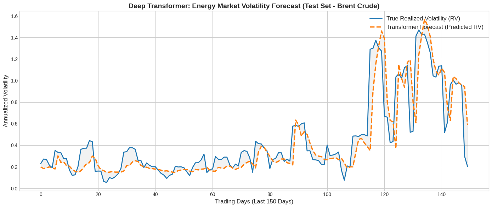

# Perception Engine: DRL Corporate Hedging in Energy Markets 📈

An end-to-end Deep Learning pipeline built with PyTorch, designed to forecast Realized Volatility (RV) in global energy markets (Brent Crude Oil & TTF Natural Gas). 

This project serves as the "Perception Engine" for a Deep Reinforcement Learning (DRL) agent. Instead of speculative trading, the goal of this system is **Corporate Risk Hedging**—allowing industrial firms to anticipate massive volatility spikes and secure derivative contracts to protect their operational margins.

## 🧠 System Architecture

The pipeline consists of a strictly object-oriented, API-resilient macroeconomic data fetcher and a sophisticated forecasting model:

1. **Multivariate Macroeconomic Pipeline:** Pulls global liquidity and market stress indicators in real-time.
   * **US Market:** 10Y Treasury, Fed Funds Rate, DXY (via FRED).
   * **European Market:** EUR/USD, Physical Euro Govt Bond ETFs (via Yahoo Finance).
   * **Emerging Markets (Turkey):** Direct REST API integration with the Central Bank of the Republic of Turkey (TCMB) for USD/TRY and Policy Rates.
   * **China/Russia:** Shanghai Composite, USD/CNY, USD/RUB proxies.
2. **Schema Enforcer & Preprocessor:** A robust alignment engine that guarantees strict tensor dimensionality `(T, N)`. It uses a `CANONICAL_COLUMNS` schema to zero-fill missing data dynamically during API outages, preventing "ghost feature" misalignment.
3. **TimeSeriesTransformer:** A deep attention-based neural network that processes `(B, W, N)` sliding windows strictly preventing data leakage.
4. **Autoregressive Feedback:** The model ingests lagged Realized Volatility alongside macro variables to maintain historical context.
5. **Asymmetric QLIKE Loss:** Trained using a custom financial loss function optimized for volatility, with a Softplus activation layer guaranteeing strictly positive outputs.

Results: 
   

## 🚀 Installation & Usage

To run this pipeline locally, clone the repository and install the required dependencies which stated in equirements: 
```bash
git clone [https://github.com/YOUR_USERNAME/YOUR_REPO_NAME.git](https://github.com/YOUR_USERNAME/YOUR_REPO_NAME.git)
cd YOUR_REPO_NAME
pip install -r requirements.txt
Once the environment is set up, initialize the pipeline: python main.py

Note: Ensure you have your FRED and EVDS API keys configured in the execution script.


Results & Forecasting
The model successfully captures non-linear macro relationships to forecast annualized volatility. Below is the Out-of-Sample test performance on Brent Crude Oil:

🛠️ Built With
PyTorch - Deep Learning Framework

Scikit-Learn - Data Scaling and Preprocessing

Pandas / NumPy - Matrix Computation and Time-Series Alignment

Requests / yfinance / pandas-datareader - REST API and Market Data Sourcing

📄 License
This project is licensed under the MIT License.
git clone [https://github.com/YOUR_USERNAME/YOUR_REPO_NAME.git](https://github.com/YOUR_USERNAME/YOUR_REPO_NAME.git)
cd YOUR_REPO_NAME
pip install -r requirements.txt
